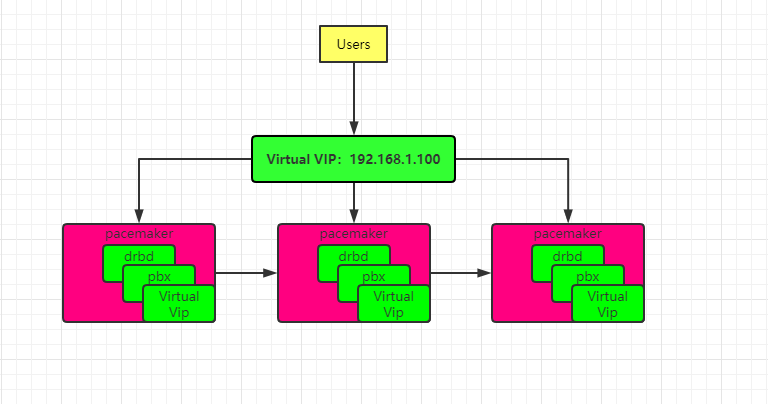

自动化安装pbx高可用
===

- [自动化安装pbx高可用](#自动化安装pbx高可用)
- [架构图](#架构图)
- [先决条件](#先决条件)
- [设置host解析](#设置host解析)
- [设置免密码登录](#设置免密码登录)
- [自动安装pacemaker 和drbd](#自动安装pacemaker-和drbd)
- [配置 Linux lvm](#配置-linux-lvm)
- [配置 DRBD](#配置-drbd)
- [初始化DRBD](#初始化drbd)
- [配置 PBX](#配置-pbx)
- [创建资源](#创建资源)
- [几个常用的命令](#几个常用的命令)
  - [查看pbx状态](#查看pbx状态)
  - [重启pbx](#重启pbx)
  - [更新pbx](#更新pbx)


PortSIP  PBX 支持部署为 HA 模式, 通常将其部署在三台 PBX 服务器上（可以是物理机或者虚拟机）。当其中一台 PBX 服务器崩溃或者出现故障后，另外两台中的一台即自动接替工作，并将之前已经注册的客户端和已经建立的通话信息进行恢复。 

在 HA 模式下，PBX 在虚拟 IP 上为客户端提供服务，所有的客户端 APP 或者 IP Phone, 都将通过这个虚拟 IP来和 PBX 通信。

------


# 架构图



# 先决条件

> 1、最少3台节点

>2、必须设置每个节点的主机名 host 解析，要求必须能够 ping 通任一节点的主机名。 本文档以 192.168.1.11, 192.168.1.12, 192.168.1.13为例，假定他们的主机名分别为 pbx01, pbx02, pbx03。

>3、3台节点各需一块新硬盘，无需分区格式化操作，要求三个节点的新硬盘大小一致。或者每个节点各需一个新分区，新分区无需格式化操作，要求三个节点的新分区大小一致。新硬盘或者新分区里面不能有文件存在。

# 设置host解析
在每一个节点执行如下命令。**注意：需要把下面的命令里的 IP 和主机名替换成你的主机名和 IP**
```
cat <<EOF >>/etc/hosts
192.168.1.11 pbx01
192.168.1.12 pbx02
192.168.1.13 pbx03
EOF
```

# 设置免密码登录
本例中，pbx01, pbx02、pbx03分别是节点1、节点2和节点3。
本例在节点 pbx01 上执行如下命令，并按照提示生成证书：

```
[root@pbx01 ~]# ssh-keygen -t rsa 
```

设置 pbx02 免密码登录：

```
[root@pbx01 ~]# ssh-copy-id -i ~/.ssh/id_rsa.pub pbx02
```

设置 pbx03 免密码登录：

```
[root@pbx01 ~]# ssh-copy-id -i ~/.ssh/id_rsa.pub pbx03
```

测试 pbx02 免密码登录：

```
[root@pbx01 ~]# ssh pbx02 "w"
 14:14:20 up 8 min,  1 user,  load average: 0.00, 0.01, 0.02
USER     TTY      FROM             LOGIN@   IDLE   JCPU   PCPU WHAT
root     pts/0    192.168.1.210    14:09    4:28   0.01s  0.01s -bash
[root@pbx01 ~]# 
```

测试 pbx03 免密码登录：

```
[root@pbx01 ~]# ssh pbx03 "w"
 14:14:20 up 8 min,  1 user,  load average: 0.00, 0.01, 0.02
USER     TTY      FROM             LOGIN@   IDLE   JCPU   PCPU WHAT
root     pts/0    192.168.1.210    14:09    4:28   0.01s  0.01s -bash
[root@pbx01 ~]# 
```


# 自动安装pacemaker 和drbd

在master上操作： **3台节点中随机选择一台当做master, 本例中，我们用 pbx01做master**,

```
yum -y install git
git clone https://github.com/portsip/portsip-pbx-ha-guide.git
cd  portsip-pbx-ha-guide
```

现在执行 pacemaker.sh，等待包安装完成后，根据提示输入账号密码：

```
./pacemaker.sh pbx02 pbx03
Username: hacluster
Password: 
```

输入用户 **hacluster** 和密码**123456**后等安装完成，然后依次执行下面命令，重启所有的节点。
```
ssh pbx02 "reboot"
ssh pbx03 "reboot"
reboot
```


# 配置 Linux lvm
在每一节点上分别执行如下命令查看 HA 要使用的硬盘名或者分区名，并记录下来：

```
fdisk -l
```

在每一台节点上分别执行如下命令：

```
yum install -y yum-utils device-mapper-persistent-data lvm2
pvcreate 该节点的硬盘名或者分区名
vgcreate pbxvg 该节点的硬盘名或者分区名
lvcreate -n pbxlv -L 128G pbxvg
```

上述命令中，挂载点为 **/dev/pbxvg/pbxlv**，128G分区大小，需要更改为您的硬盘或者分区大小。


# 配置 DRBD
以下操作只需在 master 节点上进行，本例中位 pbx01。

在 master 上 修改 DRBD 的配置文件然后使用 scp 分发到各节点。

发送全局配置文件到各节点:

```
cp -f  ./global_common.conf /etc/drbd.d/
scp ./global_common.conf  pbx02:/etc/drbd.d/
scp ./global_common.conf  pbx03:/etc/drbd.d/
```

接着在 master 上配置 DRBD，修改当前目录下pbxdata.res文件：
```
resource pbxdata {

meta-disk internal;
device /dev/drbd1;
disk /dev/pbxvg/pbxlv;

syncer {
  verify-alg sha1;
}

net {
# allow-two-primaries no;
  after-sb-0pri discard-zero-changes;
  after-sb-1pri discard-secondary;
  after-sb-2pri disconnect;
}
#节点一名字和ip
on pbx01 {
  address pbx01ip:7789;
  node-id 0;
}
#节点二名字和ip
on pbx02 {
  address pbx02ip:7789;
  node-id 1;
}
#节点三名字和ip
on pbx03 {
  address pbx03ip:7789;
  node-id 2;
}

connection-mesh {
  #节点1、2、3名字
  hosts pbx01 pbx02 pbx03;
  net {
      use-rle no;
  }
}

}
```

拷贝到本机

```
cp -f pbxdata.res /etc/drbd.d/
```
拷贝到pbx02

```
scp  pbxdata.res pbx02:/etc/drbd.d/
```

拷贝到pbx03

```
scp  pbxdata.res pbx03:/etc/drbd.d/
```


# 初始化DRBD

在每个节点上都执行如下命令启动DRBD：

```
systemctl start drbd
```

在每个节点上都查看 DRBD状态是否是 running。

```
systemctl status drbd
```

在每个节点上都执行如下命令：

```
drbdadm create-md pbxdata
drbdadm up pbxdata
```

只需 **master** 也就是 **pbx01** 上执行如下命令:

```
drbdadm -- --clear-bitmap new-current-uuid pbxdata
drbdadm primary --force pbxdata
mkfs.xfs /dev/drbd1
drbdadm secondary pbxdata
```

# 配置 PBX
部署 PortSIP PBX 为 HA 模式的时候，我们需要一个 Virtual IP 来用代表 PBX 让外部访问，这个 Virtual IP 必须没有被其他的机器所使用，本例中我们使用 **192.168.1.100** 作为 Virtual IP。在实际部署场景中，您需要根据您的网络情况来选中一个合适的 IP 作为 Virtual IP。

如下命令中，pbx02， pbx03 分别是node2和node3。
其中123456是PortSIP 数据库密码, 您也可以设置使用其他密码.
如果因为拉镜像导致执行失败，当前步骤可以多次执行，直到成功。

```json
./docker.sh pbx02 pbx03 192.168.1.100 123456 portsip/pbx:12
```

# 创建资源
在master 也就是 pbx01上执行如下操作，如果不报错证明安装成功。可通过 ./bin/pbx-status查看状态。

命令中的 192.168.1.100 是本例的 Virtual IP, 您需要替换为您的实际 Virtual IP。

```
./create_pacemaker_resources.sh  pbx02 pbx03  192.168.1.100
```


# 几个常用的命令

## 查看pbx状态
```
./bin/pbx-status
```
## 重启pbx

```
./bin/pbx-restart
```
## 更新pbx
本例其中pbx02 pbx03 分别是node2和node3
其中**123456**是PortSIP 数据库密码,  您也可以设置使用其他密码.
其中 **portsip/pbx:12** 是要更新的版本，你可以自由地使用其他版本。

如果因为拉镜像导致执行失败，本步骤可以多次执行直到成功。
命令中的 192.168.1.100 是本例的 Virtual IP, 您需要替换为您的实际 Virtual IP。

```
./bin/pbx-update pbx02 pbx03 192.168.1.100 123456 portsip/pbx:12
```

