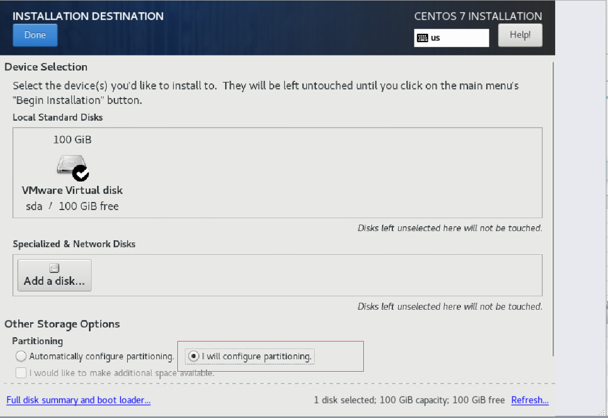
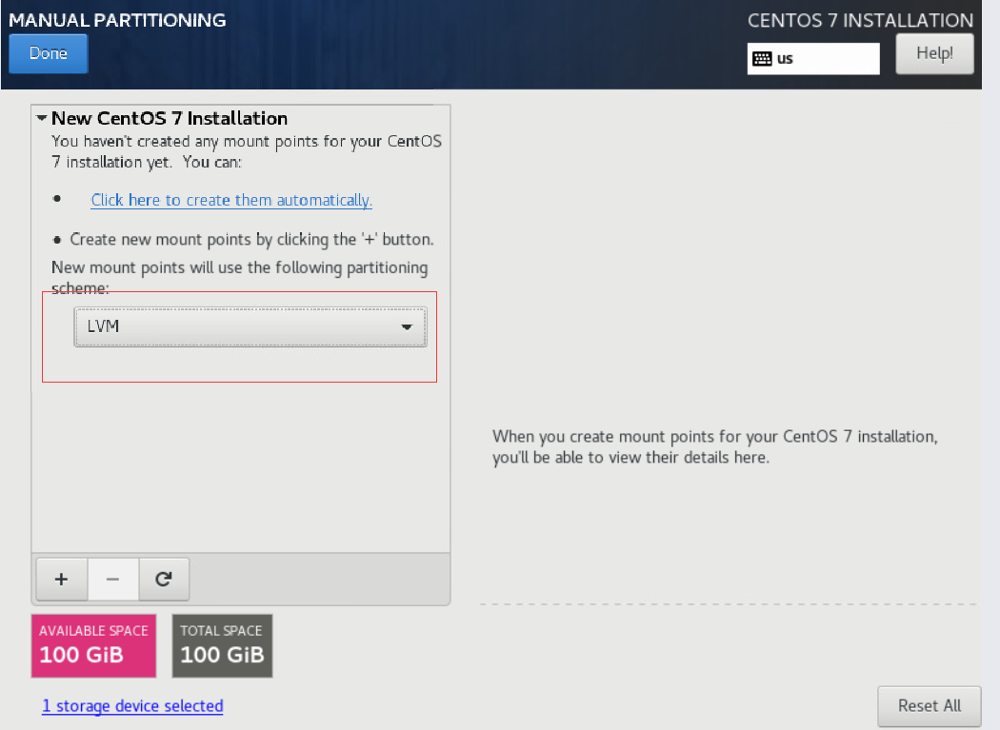
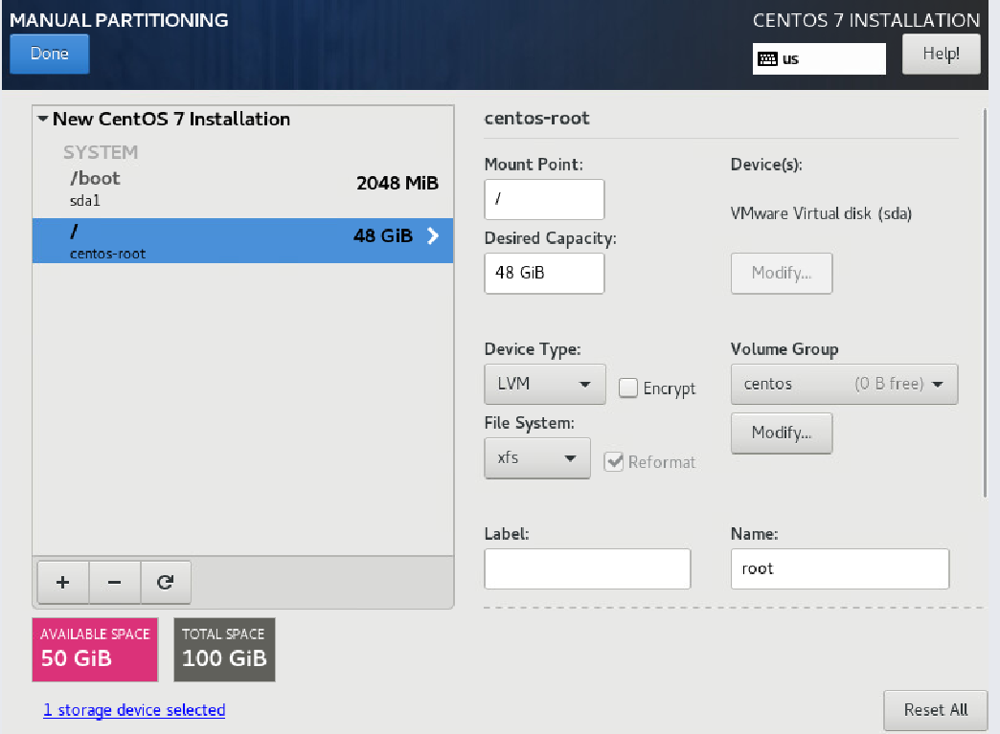
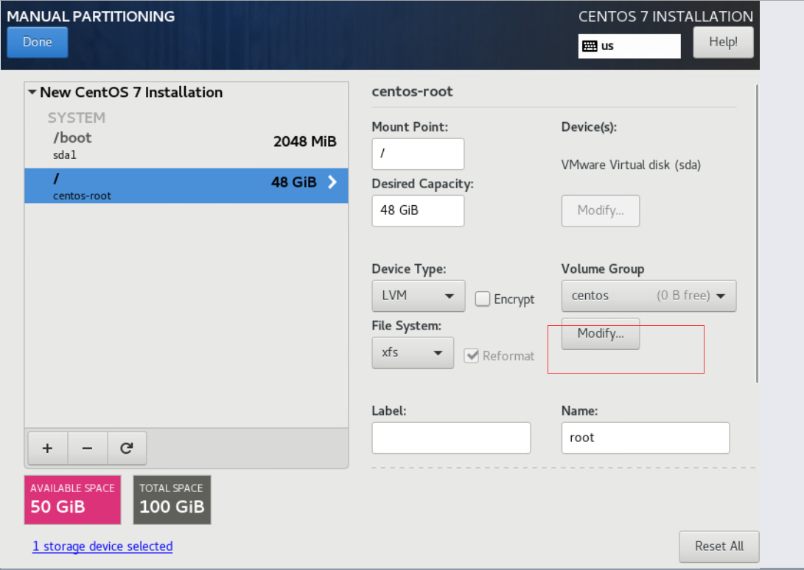
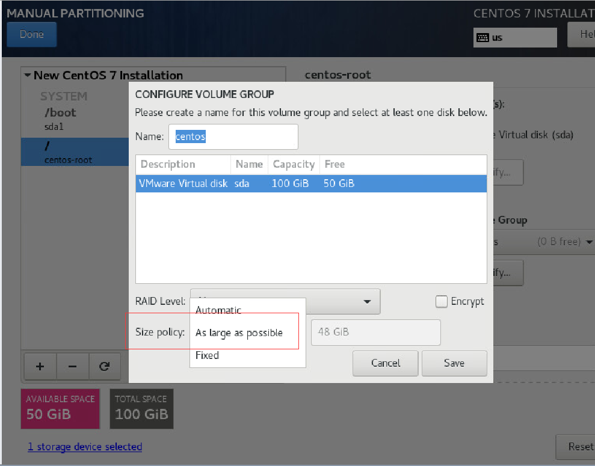
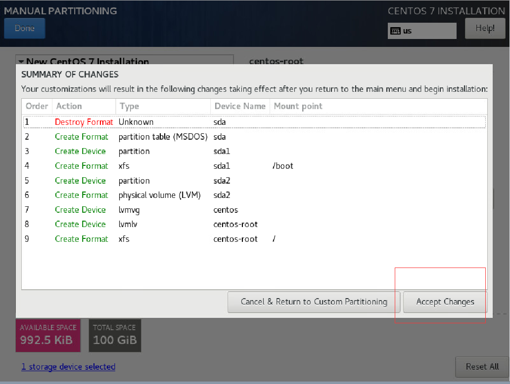

# 目录
- [目录](#目录)
- [简介](#简介)
- [原理](#原理)
- [注意事项](#注意事项)
- [安装系统](#安装系统)
  - [选择语言和键盘类型](#选择语言和键盘类型)
  - [选择最小化安装](#选择最小化安装)
  - [磁盘分区](#磁盘分区)
    - [选择 I will configure partitioning](#选择-i-will-configure-partitioning)
      - [选择 LVM](#选择-lvm)
      - [创建分区](#创建分区)
      - [设置 LVM](#设置-lvm)
        - [设置 LVM 的大小](#设置-lvm-的大小)
  - [开始安装系统](#开始安装系统)
  - [设置 root 密码](#设置-root-密码)
  - [开机检查内核版本是否和教程一致](#开机检查内核版本是否和教程一致)
  - [下载离线安装资源包](#下载离线安装资源包)
- [安装ansible](#安装ansible)
- [设置ansible 资源组](#设置ansible-资源组)
- [添加解析](#添加解析)
- [设置免密码登录](#设置免密码登录)
- [设置变量](#设置变量)
- [安装资源](#安装资源)
- [重启](#重启)
- [启动pcs](#启动pcs)
- [初始化配置资源](#初始化配置资源)
- [几个常用的命令](#几个常用的命令)
  - [查看 PBX 状态](#查看-pbx-状态)
  - [重启 PBX资源](#重启-pbx资源)
# 简介

在本手册所用示例中一共使用了 3 台服务器（下文中用 PBX 节点来指称服务器，如果说三个 PBX 节点或者所有 PBX 节点，就是指三台服务器，主节点以及节点1指 pbx01, 节点2指 pbx02, 节点3指 pbx03），每台服务器的硬盘为100G。

请将三台节点机器的主机名和 IP 改为如下:

```
192.168.78.101 pbx01
192.168.78.102 pbx02
192.168.78.103 pbx03
```

本例子使用的 vip(virtual IP) 为 192.168.78.90。
你可以自由决定服务器硬盘大小，但三台服务器的硬盘容量必须一样。
使用的操作系统镜像是 CentOS-7-x86_64-Minimal-2009.iso（这个镜像经过我们严格测试，在无网环境下可以成功安装。其他版本镜像，可能因为内核版本过低而需要升级导致安装失败）。

# 原理

PortSIP PBX HA 方案原理如下：

+ 三台 PBX 节点同时运行，以防止在 HA 切换过程中出现脑裂现象。
+ 节点之间使用 DRBD 进行数据同步，包括当前活跃通话信息，录音文件，日志，呼叫记录，用户上传的提示语音文件等。
+ 采用虚拟 IP(VIP) 作为系统的访问入口。
+ 使用 Pacemaker 对服务器之间的状态进行监控。
+ 主节点对外提供服务，一旦主节点出现故障 DOWN 机，Pacemaker 检测到后立刻将 VIP 漂移到接替工作的备用节点，用户业务请求将被自动路由到备用节点，备用节点继续提供服务。
+ 主节点上已经建立的通话，将会自动被备用节点进行恢复。

**实际测试过程中，可采取主节点断电或者断网的方式来模拟故障。**


# 注意事项

> 1、除非注明，否则下文提及的操作只在主节点 pbx01 上执行

> 2、因为离线资源包过大，所以如果出现卡死的情况，耐心等待既可

> 3、请把3台节点的主机名，改为pbx01、pbx02、pbx03

> 4、建议硬件配置4核4G，如果低于2核2G，ha切换时受硬件影响，通话恢复时间会增加


# 安装系统


**注意，在三台节点服务器上都需要按照本节所描述的相同步骤来安装配置 CentOS 操作系统。**

## 选择语言和键盘类型


## 选择最小化安装


## 磁盘分区


### 选择 I will configure partitioning




#### 选择 LVM




#### 创建分区

> **注意**，本例使用的硬盘容量是 100G ，给根目录 / 分配 48G，给 /boot 分配 2G，50G 留给 PBX 在后续步骤中使用。用户安装时需按照硬盘实际大小合理分配，留给 PBX 的空间尽可能大（需要存储 PBX 录音文件，数据库文件等）。




#### 设置 LVM

如下图，点击 **Modify** 按钮。




##### 设置 LVM 的大小

本例中，在留给 PBX 的 50G空间上设置 LVM 分区名为 **centos** , **size policy** 选择 "**As large as possible**"。 
点击 **Save** 按钮，一切正常，点击 **Accept Changes** 按钮。






## 开始安装系统


## 设置 root 密码


## 开机检查内核版本是否和教程一致


## 下载离线安装资源包
```
wget http://www.portsip.cn/downloads/portsip-pbx-ha-guide-12.3.2.93.tar.gz && tar xf portsip-pbx-ha-guide-12.3.2.93.tar.gz && cd portsip-pbx-ha-guide
```


# 安装ansible
只在主节点也就是节点 pbx01 执行如下命令：
```
yum install epel-release -y  && yum install ansible -y && yum remove epel-release
```

# 设置ansible 资源组
只在主节点也就是节点 pbx01 执行如下命令：
```
cat <<EOF >>/etc/ansible/hosts
[master]
pbx01
[node]
pbx02
pbx03
EOF
```
# 添加解析
只在主节点也就是节点 pbx01 执行如下命令：
注意：需要把下面命令里的 IP 和主机名替换成你实际使用的 IP 和 主机名。
```
cat <<EOF >>/etc/hosts
192.168.78.101 pbx01
192.168.78.102 pbx02
192.168.78.103 pbx03
EOF
```
# 设置免密码登录

本例中，pbx01、pbx02、pbx03分别是指节点1、节点2和节点3。
**以下命令只需在主节点也就是节点 pbx01 上执行，并按照提示生成证书：**

```
[root@pbx01 ~]# ssh-keygen -t rsa 
Generating public/private rsa key pair.
Enter file in which to save the key (/root/.ssh/id_rsa):   输入回车
Enter passphrase (empty for no passphrase):  输入回车
Enter same passphrase again:  输入回车
Your identification has been saved in /root/.ssh/id_rsa.
Your public key has been saved in /root/.ssh/id_rsa.pub.
The key fingerprint is:
SHA256:zEsSndOuTmwMChtQXPDlMoYHELlIKq5HOxwIR1x+zO4 root@kubernetes01
The key's randomart image is:
+---[RSA 2048]----+
|o*++o .          |
|.o+= = . o       |
|=o. B * + .      |
|*..o = + o       |
|+oo   + S .      |
|..o+ o * o       |
|.o.o. E B        |
|. =    +         |
| . .    .        |
+----[SHA256]-----+
[root@pbx01 ~]# 
```
**设置 pbx01 免密码登录（在节点 pbx01上执行）：**

```

// 根据提示输入密码，如果出现（yes/no）?,需要输入yes
[root@pbx01 ~]# ssh-copy-id -i ~/.ssh/id_rsa.pub pbx01
```

**设置 pbx02 免密码登录（在节点 pbx01上执行）：**

```

// 根据提示输入密码，如果出现（yes/no）?,需要输入yes
[root@pbx01 ~]# ssh-copy-id -i ~/.ssh/id_rsa.pub pbx02
```


**设置 pbx03 免密码登录（在节点 pbx01上执行）：**

```

// 根据提示输入密码，如果出现（yes/no）?,需要输入yes
[root@pbx01 ~]# ssh-copy-id -i ~/.ssh/id_rsa.pub pbx03
```

# 设置变量
如下命令只在主节点也就是节点 pbx01 上执行。
**注意把pbx01、pbx02、pbx03、vip、pbxlv(lvm的大小，根据安装系统时候实际设置的大小修改)相关信息改为自己真实的信息**

> 之前安装 CentOS 分区时（前面 “**设置 LVM**“ 小节），我们给 CentOS LVM 留了50G 的空间，这里我们使用 49G（pbxlv: 49G，直接使用50G可能报错空间不足。你需要根据你的实际硬盘情况确定，比如你安装的时候给 LVM 留的是 500G 空间，建议使用 495G 或者 490G: pbxlv: 490G）。

```
cd /root/portsip-pbx-ha-guide

cat <<EOF >/root/portsip-pbx-ha-guide/vars.yml
pbx01: 192.168.78.101
pbx02: 192.168.78.102
pbx03: 192.168.78.103
vip: 192.168.78.90
pwd: 123456
images: portsip/pbx:12.3.2.93
pbxlv: 49G
EOF

```


# 安装资源
只在主节点也就是节点 pbx01 执行如下命令：
```
[root@pbx01 ~]# ansible-playbook install.yml
```


# 重启
只在主节点也就是节点 pbx01 执行如下命令：
```
ssh pbx02 "reboot"
ssh pbx03 "reboot"
reboot
```


# 启动pcs
重启之后，只在主节点也就是节点 pbx01 执行如下命令：
```
pcs cluster enable --all
pcs cluster start --all
```


# 初始化配置资源
只在主节点也就是节点 pbx01 执行如下命令（执行过程可能较长，耐心等待即可，中途不要中断、重启或者关机）：
```
[root@pbx01 ~]# cd /root/portsip-pbx-ha-guide/ && ansible-playbook config.yml
```

资源配置完成后，您可以使用浏览器打开 http://192.168.78.90:8888 或者  https://192.168.78.90:8887 来配置您的 PBX。

后续对 PBX 的管理配置和访问，都是通过 Virtual IP 192.168.78.90 来进行。

设置向导的第一步填写 Virtual IP，您需要替换为您的实际 Virtual IP。


进入 PBX 的 web 管理界面后，在菜单 **Advanced > Settings > Advanced** 页面下勾选 **Enable call recovery** 并点击 "**Apply**" 按钮。


# 几个常用的命令
```
基于/root/portsip-pbx-ha-guide目录
```

## 查看 PBX 状态

```
/bin/bash ./bin/pbx-status

如下输出，信息表示所有组件运行正常，pbx03为master pbx01、pbx02为slave节点
[root@pbx01 portsip-pbx-ha-guide]# /bin/bash ./bin/pbx-status
 Master/Slave Set: drbd_devpath_master [drbd_devpath]
     Masters: [ pbx03 ]
     Slaves: [ pbx01 pbx02 ]
 vip  (ocf::heartbeat:IPaddr2):  Started pbx03
 src_pkt_ip  (ocf::heartbeat:IPsrcaddr):  Started pbx03
 datapath_fs  (ocf::heartbeat:Filesystem):  Started pbx03
 pbx  (ocf::portsip:pbx):  Started pbx03
[root@pbx01 portsip-pbx-ha-guide]# 

```


## 重启 PBX资源

如下命令执行后，将会重启整个集群pbx相关资源。

```
/bin/bash ./bin/pbx-restart


如下是执行成功的输出信息
[root@pbx01 portsip-pbx-ha-guide]# /bin/bash ./bin/pbx-restart
drbd_devpath_master successfully restarted
vip successfully restarted
src_pkt_ip successfully restarted
datapath_fs successfully restarted
pbx successfully restarted
[root@pbx01 portsip-pbx-ha-guide]# 
```