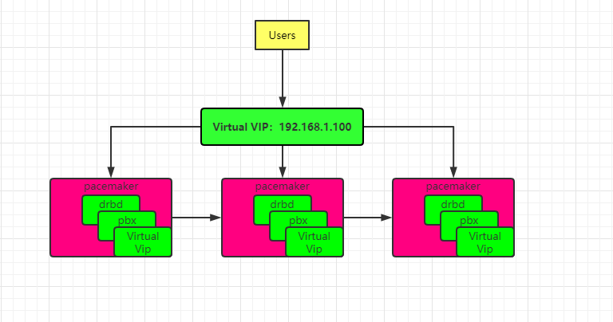

# Deploy PortSIP PBX as HA mode

- [Architecture diagram](#Architecture-diagram)
- [Prerequisites](#Prerequisites)
- [Resolve to the host name](#Resolve-to-the-host-name)
- [Setup passwordless SSH login](#Setup-passwordless-SSH-login)
- [Install pacemaker and drbd automatically](#Install-pacemaker-and-drbd-automatically)
- [Configure the Linux lvm](#Configure-the-Linux-lvm)
- [Configure DRBD](#Configure-DRBD)
- [Initialize the DRBD](#Initialize-the-DRBD)
- [Configure PBX](#Configure-PBX)
- [Create resources](#Create-resources)
- [Frequently used commands](#Frequently-used-commands)
  - [Check PBX status](#Check-PBX-status)
  - [Restart pbx](#Restart-pbx)
  - [Update pbx](#Update-pbx)


PortSIP  PBX supports deploy as the HA mode, typically deploy with three servers(Physical machine or Virtual machine). When one of the PBX servers is down, the registrations and calls on this PBX server will be restored on another server automatically.

With the HA mode, the PBX uses a virtual IP to provide the service to client, the client app / IP Phone register to the PBX and make call with the PBX by this virtual IP.


## Architecture diagram


## Prerequisites
> 1、Must starting with a minimum of three PBX nodes

> 2、The OS should be: CentOS 7.6, 64 bit; Ubuntu 18.04, 64bit; Debian 9.8, 64bit

>3、Must resolve three PBX  nodes host name to the IP, each host should can be ping from other nodes. In this guide, we assuming the nodes IP is 192.168.1.11, 192.168.1.12, 192.168.1.13 and the host name is pbx01, pbx02, pbx03。

>4、Each node needs a new disk or a new disk partition , no formatting required. The disk or disk partition size should be same, don't put any files into the disk / disk partition.
## Resolve to the host name
Perform command on each node. **Note: you must replace the IP and host name by your IP and host name**
```
cat <<EOF >>/etc/hosts
192.168.1.11 pbx01
192.168.1.12 pbx02
192.168.1.13 pbx03
EOF
```
## Setup passwordless SSH login
**This step is very important!**

We assuming the host name pbx01, pbx02、pbx03 is the node 1, node 2, node 3.

Perform below commands on pbx01, enter necessary information according the prompts：

```
[root@pbx01 ~]# ssh-keygen -t rsa 
```

Setup passwordless SSH login on for pbx02：

```
[root@pbx01 ~]# ssh-copy-id -i ~/.ssh/id_rsa.pub pbx02
```

Setup passwordless SSH login for pbx03：

```
[root@pbx01 ~]# ssh-copy-id -i ~/.ssh/id_rsa.pub pbx03
```

Test passwordless SSH login for pbx02:

```
[root@pbx01 ~]# ssh pbx02 "w"
 14:14:20 up 8 min,  1 user,  load average: 0.00, 0.01, 0.02
USER     TTY      FROM             LOGIN@   IDLE   JCPU   PCPU WHAT
root     pts/0    192.168.1.210    14:09    4:28   0.01s  0.01s -bash
[root@pbx01 ~]# 
```

Test password less SSH login on pbx03:

```
[root@pbx01 ~]# ssh pbx03 "w"
 14:14:20 up 8 min,  1 user,  load average: 0.00, 0.01, 0.02
USER     TTY      FROM             LOGIN@   IDLE   JCPU   PCPU WHAT
root     pts/0    192.168.1.210    14:09    4:28   0.01s  0.01s -bash
[root@pbx01 ~]# 
```


## Install pacemaker and drbd automatically

Let us make the pbx01 as master, and perform below commands on it:

```
yum -y install git
git clone https://github.com/portsip/portsip-pbx-ha-guide.git
cd  portsip-pbx-ha-guide
```

Now perform **pacemaker.sh**，waiting for the installation completed then enter the username and password as prompt:

```
./pacemaker.sh pbx02 pbx03
Username: hacluster
Password: 
```

Enter usenrmae as **hacluster** and password as **123456**, waiting for the installation completed，then perform below commands one by one to restart all nodes:
```
ssh pbx02 "reboot"
ssh pbx03 "reboot"
reboot
```


## Configure the Linux lvm
Perform below command  on each pbx node to show the disk name or disk partition name, note them:

```
fdisk -l
```

Perform below commands on each PBX node (**You should replace the diskname by your real disk name or disk partition name** ):

```
yum install -y yum-utils device-mapper-persistent-data lvm2
pvcreate diskname
vgcreate pbxvg diskname
lvcreate -n pbxlv -L 128G pbxvg
```

In above commands, the mount point is /dev/pbxvg/pbxlv ( **don't change it**), and disk / disk partition size is 128G, **you should change the size to your disk / disk partition actually size.**


## Configure DRBD
Just need to modify the DRBD configure on master node (in case is the pbx01) file then send to other nodes.

Send the global configure file to other nodes:

```
cp -f  ./global_common.conf /etc/drbd.d/
scp ./global_common.conf  pbx02:/etc/drbd.d/
scp ./global_common.conf  pbx03:/etc/drbd.d/
```


Modify the **pbxdata.res** in currently path:

```
resource pbxdata {

meta-disk internal;
device /dev/drbd1;
disk /dev/pbxvg/pbxlv;

syncer {
  verify-alg sha1;
}

net {
# allow-two-primaries no;
  after-sb-0pri discard-zero-changes;
  after-sb-1pri discard-secondary;
  after-sb-2pri disconnect;
}
# node 1 
on pbx01 {
  address pbx01ip:7789;
  node-id 0;
}
# node 2
on pbx02 {
  address pbx02ip:7789;
  node-id 1;
}
# node 3
on pbx03 {
  address pbx03ip:7789;
  node-id 2;
}

connection-mesh {
  # the host name of node 1, node 2, node 3
  hosts pbx01 pbx02 pbx03;
  net {
      use-rle no;
  }
}

}
```

Copy to local host

```
cp -f pbxdata.res /etc/drbd.d/
```
Copy to pbx02

```
scp  pbxdata.res pbx02:/etc/drbd.d/
```

Copy to pbx03

```
scp  pbxdata.res pbx03:/etc/drbd.d/
```


### Initialize the DRBD

Start the DRBD on each node:

```
systemctl start drbd
```

Check the DRBD status whether or not is running on each node:

```
systemctl status drbd
```

Perform below commands on each node:

```
drbdadm create-md pbxdata
drbdadm up pbxdata
```

Perform below command **only on master,  i.e. pbx01:**

```
drbdadm -- --clear-bitmap new-current-uuid pbxdata
drbdadm primary --force pbxdata
mkfs.xfs /dev/drbd1
drbdadm secondary pbxdata
```


## Configure PBX
When configure the PBX as HA mode, we will need a virtual IP for access the PBX cluster, this virtual IP mustn't be used by others.

In below commands, **we assume use 192.168.1.100 for virtual IP.**

The 123456 is he PBX DB password, the pbx02 and pbx03 is the host name of node1, node2.

If you get failed in this step, you can repeat below command until succeeded.

```json
./docker.sh pbx02 pbx03 192.168.1.100 123456 portsip/pbx:12
```
## Create resources
Perform below commands on master node(In case is the pbx01)，If there no error appears then you successfully configured the PortSIP PBX HA。

The 192.168.1.100 is the virtual IP you used.

You can use **./bin/pbx-status** to view the status.

```
./create_pacemaker_resources.sh  pbx02 pbx03  192.168.1.100
```


# Frequently used commands

## Check PBX status
```
./bin/pbx-status
```
## Restart pbx

```
./bin/pbx-restart
```
## Update pbx
In case the pbx02 is node2, pbx 03 is node3.
The 123456 is password for PortSIP PBX DB, you can use other words as your password.
The **portsip/pbx:12** is the new version which need update to.

The 192.168.1.100 is the virtual IP you used.

If you get failed in this step, you can repeat below command until success.

Perform below command on pbx01:

```
./bin/pbx-update pbx02 pbx03 192.168.1.100 123456 portsip/pbx:12
```
