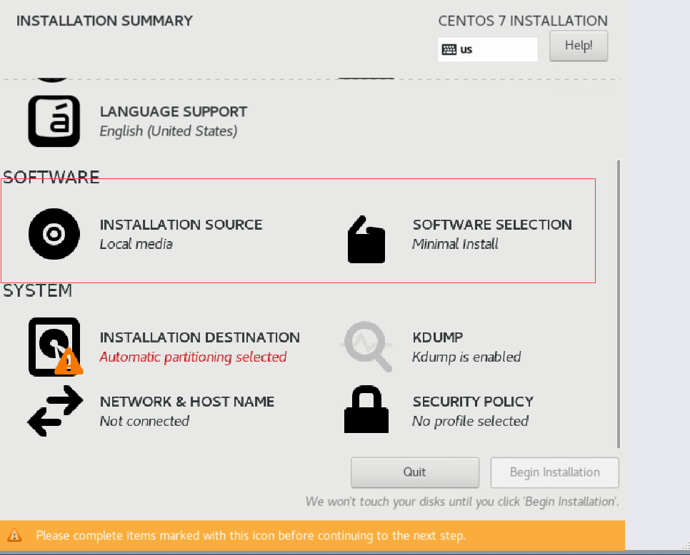
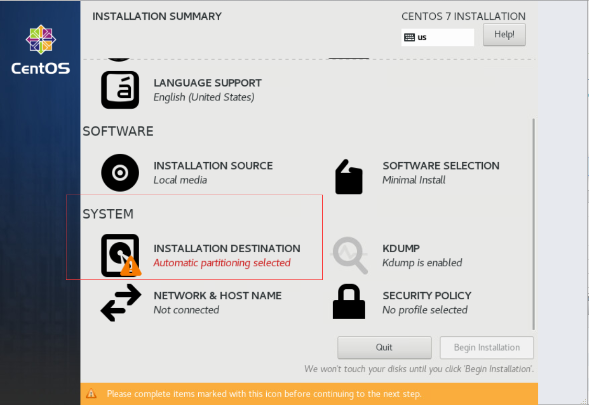
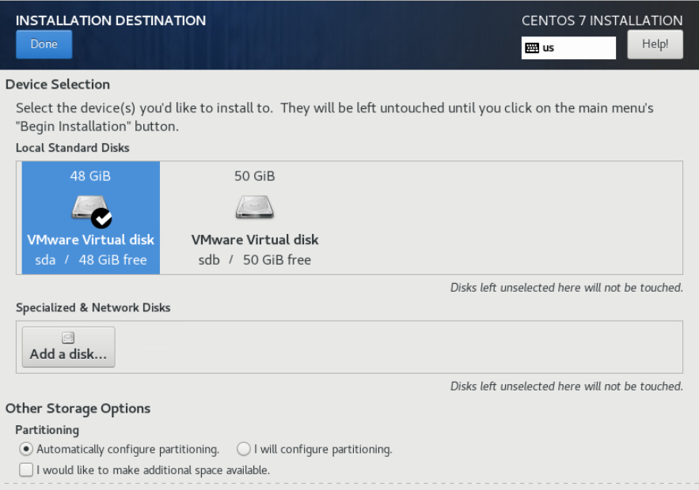
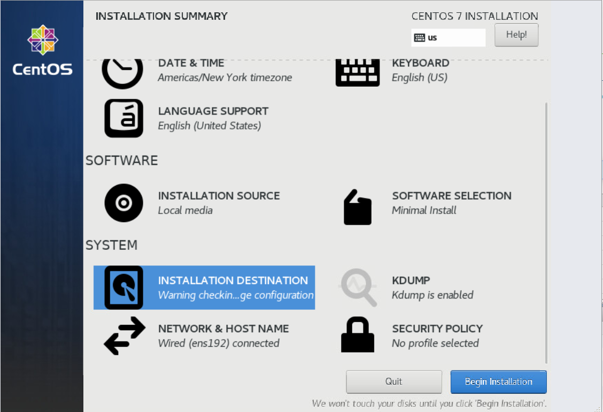
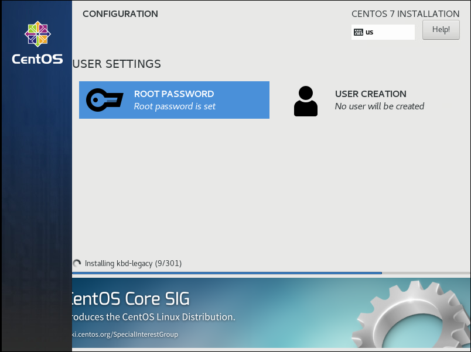
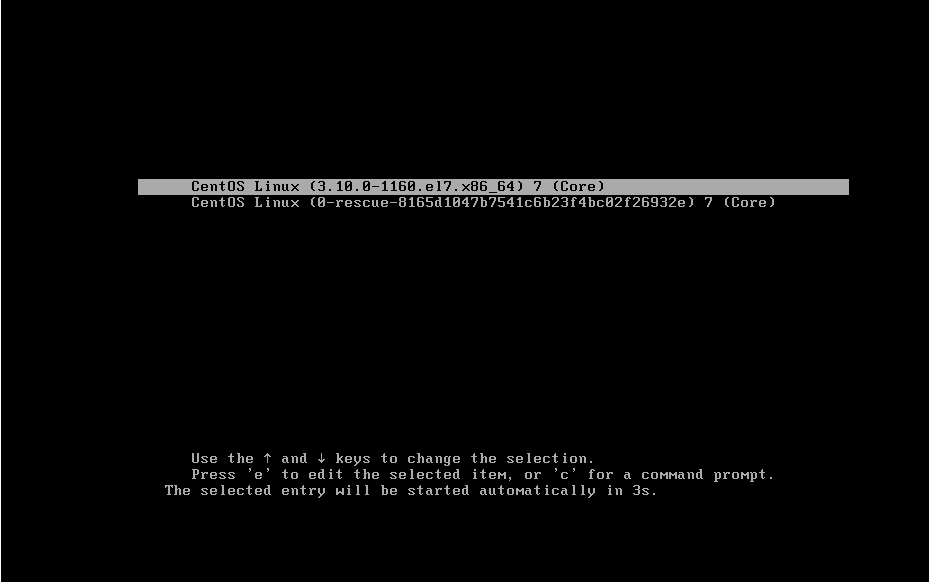
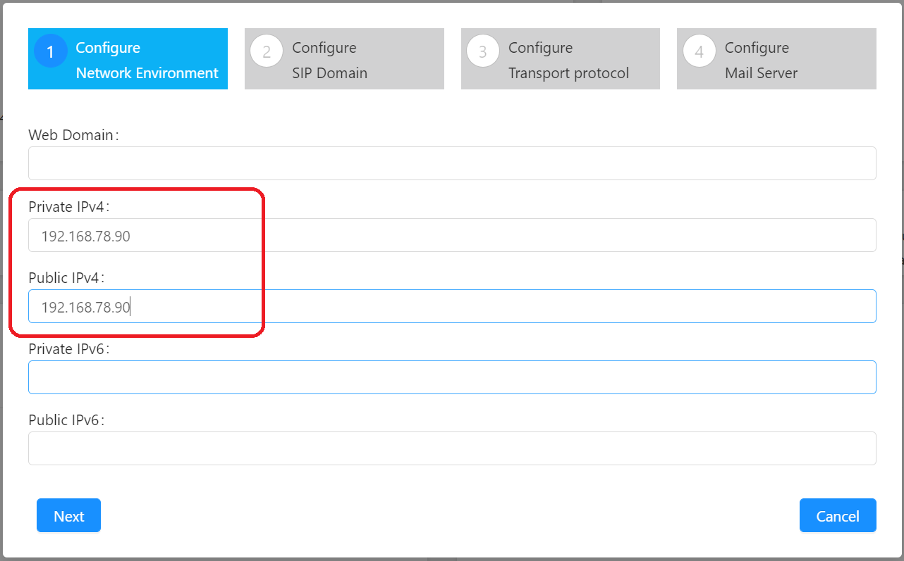
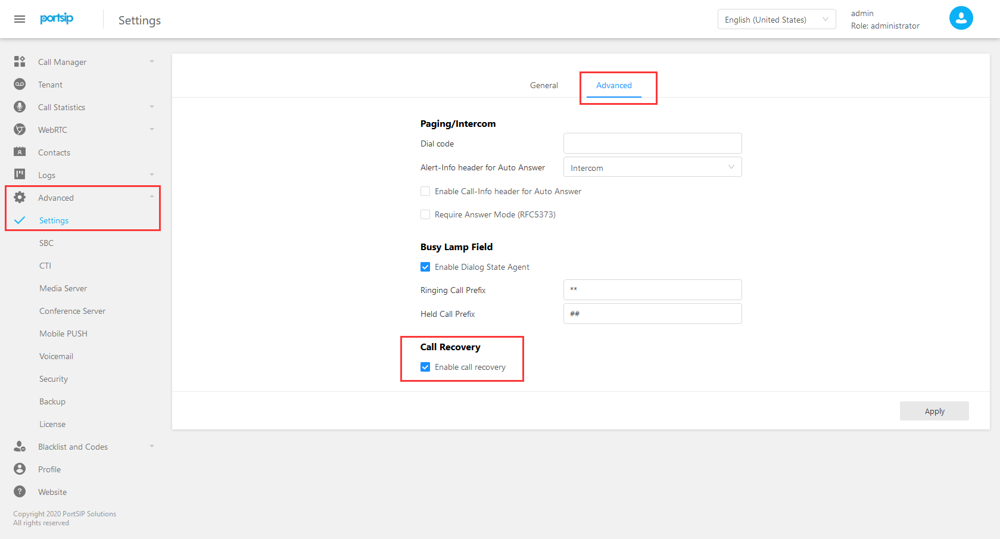

# index
[TOC]

# Introduction

This manual is for guide deploy the PortSIP HA on CentOS 7.9.

In the examples used in this manual, a total of three servers are used (PBX nodes are used to refer to servers in the following, if three PBX nodes or all PBX nodes refer to three servers, master node and node 1 refer to pbx01, node 2 refer to pbx02, and node 3 refer to pbx03). 

For deploy the HA, it requires have two disk volume. In this example the hard disk of each server is 98GB, and created two volumes, one is 48G(**/dev/sda**) for Linux OS we called it as "**system volume**", another one 50G(**/dev/sdb**) for store the PBX data, we called it as "**data volume**".

You are free to decide the disk size, but the size must be same with all servers.

In this example we deploy the HA on three servers which have the IP: 192.168.78.101, 192.168.78.102, 192.168.78.103, the VIP (virtual IP) used in this example is 192.168.78.90.

Please change the host names and IP addresses of the three node machines as follows:

```
192.168.78.101 pbx01
192.168.78.102 pbx02
192.168.78.103 pbx03
```


The OS version is requires CentOS 7.9.


# Principle

PortSIP PBX HA The principle of the scheme is as follows：

+ Three PBX nodes are running at the same time to prevent split-brain during HA switching.
+ Use DRBD to synchronize data between nodes, including current active call information, recording files, logs, call records, and prompt voice files uploaded by users.
+ Use virtual IP (VIP) as the access entry point of the system.
+ Use Pacemaker to monitor the status between servers.
+ The primary node provides services. Once the primary node has a DOWN machine, Pacemaker will immediately drift the VIP to the standby node that takes over after detecting it. User service requests will be automatically routed to the standby node, and the standby node will continue to provide services.
+ The established call on the primary node will be automatically restored by the standby node.

**In the actual test process, the main node can be cut off or disconnected to simulate the fault。**

# Precautions


>1. Unless otherwise specified, the operations mentioned below are only performed on the master node pbx01

>2. Please change the host names of the three nodes to pbx01, pbx02 and pbx03

>3. It is recommended to configure 4 cores CPU and 4G memory hardware. If it is lower than 2-cores CPU or 2G memory, ha handoff will be affected by hardware, and call recovery time will increase


# Installation system

**Note that you need to follow the same steps described in this section to install and configure the CentOS operating system on all three node servers.**

## Select language and keyboard type


## Choose minimize installation




## Disk partition




### Choose "Automatically configure partitioning"

Only need to select the disk volume "**sda**", don't touch the "**sdb**".




## Start installing the system




## Set root password




## Boot to check whether the kernel version is consistent with the tutorial




## Download installation resource package

Perform the following command only at the master node, that is, node pbx01.

```shell
[root@pbx01 ~]# cd /root
[root@pbx01 ~]# wget https://www.portsip.com/downloads/ha/lan/portsip-pbx-ha-guide-12-online.tar.gz && \
                tar xf portsip-pbx-ha-guide-12-online.tar.gz && \
                cd portsip-pbx-ha-guide
```

# Install ansible
Perform the following command only at the master node, that is, node pbx01.

```shell
[root@pbx01 ~]# yum install epel-release -y  && yum install ansible -y && yum remove epel-release -y
```

# Set ansible resource group

Perform the following command only at the master node, that is, node pbx01.

```shell
[root@pbx01 ~]# cat <<EOF >>/etc/ansible/hosts
[master]
pbx01
[node]
pbx02
pbx03
EOF
```


# Resolve the hostname

Perform the following commands at the all nodes:  pbx01, pbx02, pbx03.
Note: you need to replace the IP and host name in the following command with your actual IP and host name.

```shell
[root@pbx01 ~]# cat <<EOF >>/etc/hosts
192.168.78.101 pbx01
192.168.78.102 pbx02
192.168.78.103 pbx03
EOF
```
```shell
[root@pbx02 ~]# cat <<EOF >>/etc/hosts
192.168.78.101 pbx01
192.168.78.102 pbx02
192.168.78.103 pbx03
EOF
```

```shell
[root@pbx03 ~]# cat <<EOF >>/etc/hosts
192.168.78.101 pbx01
192.168.78.102 pbx02
192.168.78.103 pbx03
EOF
```


# Set password free login

In this example, pbx01, pbx02 and pbx03 refer to node 1, node 2 and node 3 respectively.
**The following command only needs to be executed on the primary node, that is, pbx01, and the certificate is generated according to the prompt:**

```shell
[root@pbx01 ~]# ssh-keygen -t rsa 
Generating public/private rsa key pair.
Enter file in which to save the key (/root/.ssh/id_rsa):  Enter carriage return
Enter passphrase (empty for no passphrase):  Enter carriage return
Enter same passphrase again:  Enter carriage return
Your identification has been saved in /root/.ssh/id_rsa.
Your public key has been saved in /root/.ssh/id_rsa.pub.
The key fingerprint is:
SHA256:zEsSndOuTmwMChtQXPDlMoYHELlIKq5HOxwIR1x+zO4 root@kubernetes01
The key's randomart image is:
+---[RSA 2048]----+
|o*++o .          |
|.o+= = . o       |
|=o. B * + .      |
|*..o = + o       |
|+oo   + S .      |
|..o+ o * o       |
|.o.o. E B        |
|. =    +         |
| . .    .        |
+----[SHA256]-----+
[root@pbx01 ~]# 
```
**Set up pbx01 password free login (executed on pbx01 node):**

```shell

//Enter the password according to the prompt. If (yes / no)? Appears, you need to enter yes
[root@pbx01 ~]# ssh-copy-id -i ~/.ssh/id_rsa.pub pbx01
```

**Set up pbx02 password free login (executed on pbx01 node):**

```shell

//Enter the password according to the prompt. If (yes / no)? Appears, you need to enter yes
[root@pbx01 ~]# ssh-copy-id -i ~/.ssh/id_rsa.pub pbx02
```


**Set up pbx03 password free login (executed on pbx01 node):**

```shell

//Enter the password according to the prompt. If (yes / no)? Appears, you need to enter yes
[root@pbx01 ~]# ssh-copy-id -i ~/.ssh/id_rsa.pub pbx03
```


# Set variables

Please prepare the value for the below Variables.

| Name              | Type   | Description                                                  |
| ----------------- | ------ | ------------------------------------------------------------ |
| pbx01_hostname    | string | The hostname of node 1, in this case is pbx01                |
| pbx02_hostname    | string | The hostname of node 2, in this case is pbx02                |
| pbx03_hostname    | string | The hostname of node 2, in this case is pbx02                |
| pbx01_private_ip  | string | The private **static** IP of node 1, in this case is 192.168.78.101 |
| pbx02_private_ip  | string | The private **static** IP of node 2, in this case is 192.168.78.102 |
| pbx03_private_ip  | string | The private **static** IP of node 3, in this case is 192.168.78.103 |
| vip               | string | The virtual IP in this case is 192.168.78.90                 |
| pcs_hacluster_pwd | string | The HA cluster user password, in this case is 123456         |
| db_pwd            | string | The database password in the cluster, in this case is 123456 |
| pbx_image         | string | PortSIP PBX docker image  in this case is portsip/pbx:12.6   |
| pbx_datapath_disk | string | The disk volume(**data volume**) for PBX data store in this case is **/dev/sdb** |
| pbx_datapath_size | string | The disk volume(**data volume, /dev/sdb**)  size for store the PBX data，in this case is 49G（If use 50G maybe report error）<br>For example if the disk volume size is 500G , suggest set as 490G. |


The following command is only executed on the master node, that is, node pbx01.
**Pay attention to change the information about pbx01, pbx02, pbx03, VIP and pbx_datapath_size to your own real information.**

```shell
[root@pbx01 ~]# cd /root/portsip-pbx-ha-guide
[root@pbx01 ~]# cat <<EOF >/root/portsip-pbx-ha-guide/vars.yml
pbx01_hostname: pbx01
pbx02_hostname: pbx02
pbx03_hostname: pbx03
pbx01_private_ip: 192.168.78.101
pbx02_private_ip: 192.168.78.102
pbx03_private_ip: 192.168.78.103
vip: 192.168.78.90
pcs_hacluster_pwd: 123456
db_pwd: 123456
pbx_image: portsip/pbx:12.6
pbx_datapath_disk: /dev/sdb
pbx_datapath_size: 49G
EOF
```


# Install resources

Execute the following command only on the master node, that is, node pbx01.
```shell
[root@pbx01 ~]# ansible-playbook install.yml
```


# Restart

Execute the following command only on the master node, that is, node pbx01.

```shell
[root@pbx01 ~]# ssh pbx02 "reboot"
[root@pbx01 ~]# ssh pbx03 "reboot"
[root@pbx01 ~]# reboot
```


# Start PCs

After restart, execute the following command only at the primary node, that is, node pbx01:

```shell
[root@pbx01 ~]# pcs cluster enable --all
[root@pbx01 ~]# pcs cluster start --all
```


# Initialize configuration resources

Only at the master node, that is, pbx01, execute the following commands (the execution process may be long, just wait patiently, and don't interrupt, restart or shut down in the middle of the process)

```shell
[root@pbx01 ~]# cd /root/portsip-pbx-ha-guide/ && ansible-playbook config.yml
```

After the resource configuration is completed, you can use the browser to open it http://192.168.78.90 : 8888 or https://192.168.78.90 : 8887 to configure your PBX.
Subsequent PBX management, configuration and access are carried out through virtual IP 192.168.78.90.
The first step of the setup wizard is to fill in the virtual IP. You need to replace it with your actual virtual IP.




After entering the web management interface of PBX, under the menu **advanced > Settings > Advanced** page, check **enable call recovery** and click the "**apply**" button.



# Several common commands
```
Based on /root/portsip-pbx-ha-guide directory
```

## View PBX status

```shell
/bin/bash ./bin/pbx-status

The following output shows that all components are running normally. Pbx03 is the master, pbx01 and pbx02 are slave nodes
[root@pbx01 portsip-pbx-ha-guide]# /bin/bash ./bin/pbx-status
 Master/Slave Set: drbd_devpath-clone [drbd_devpath]
     Masters: [ pbx03 ]
     Slaves: [ pbx01 pbx02 ]
 vip  (ocf::heartbeat:IPaddr2):  Started pbx03
 src_pkt_ip  (ocf::heartbeat:IPsrcaddr):  Started pbx03
 datapath_fs  (ocf::heartbeat:Filesystem):  Started pbx03
 pbx  (ocf::portsip:pbx):  Started pbx03
[root@pbx01 portsip-pbx-ha-guide]# 

```


## Restart PBX resource
After the following command is executed, the PBX related resources of the whole cluster will be restarted.

```shell
/bin/bash ./bin/pbx-restart


The following is the output of successful execution
[root@pbx01 portsip-pbx-ha-guide]# /bin/bash ./bin/pbx-restart
drbd_devpath_master successfully restarted
vip successfully restarted
src_pkt_ip successfully restarted
datapath_fs successfully restarted
pbx successfully restarted
[root@pbx01 portsip-pbx-ha-guide]# 
```

<br/>

## Upgrade PBX

**Important**: Only at the master node, that is, pbx01, perform the following commands.<br/>
<br/>

### Update the script

```shell
[root@pbx01 ~] cd /root
[root@pbx01 ~]# wget https://www.portsip.com/downloads/ha/lan/portsip-pbx-ha-guide-12-online.tar.gz && \
                tar xf portsip-pbx-ha-guide-12-online.tar.gz && \
                cd portsip-pbx-ha-guide
```

<br/>

### Modify the config file

Edit the `/root/portsip-pbx-ha-guide/vars.yml` to change the `PortSIP PBX` docker image version.<br/>

```
...
...
pbx_image: [The new PBX docker image version, for example: portsip/pbx:12.6.4.919-release]
...
...
```

<br/>

### Upgrade

```
[root@pbx01 ~]# cd /root/portsip-pbx-ha-guide/ && ansible-playbook update.yml
```
