# 目录
[TOC]

# 简介

在本手册所用示例中一共使用了 3 台服务器（下文中用 PBX 节点来指称服务器，如果说三个 PBX 节点或者所有 PBX 节点，就是指三台服务器，主节点以及节点1指 pbx01, 节点2指 pbx02, 节点3指 pbx03），每台服务器的系统盘大小为48G（/dev/sda）、数据盘大小为50G（/dev/sdb）。

请将三台节点机器的主机名和 IP 改为如下:

```
192.168.78.101 pbx01
192.168.78.102 pbx02
192.168.78.103 pbx03
```

本例子使用的 vip(virtual IP) 为 192.168.78.90。
你可以自由决定服务器硬盘大小，但三台服务器的`数据盘容量`必须一样。
使用的操作系统镜像是 `ubuntu-20.04.2-live-server-amd64.iso`（这个镜像经过我们严格测试，可以成功安装）。

# 原理

PortSIP PBX HA 方案原理如下：

+ 三台 PBX 节点同时运行，以防止在 HA 切换过程中出现脑裂现象。
+ 节点之间使用 DRBD 进行数据同步，包括当前活跃通话信息，录音文件，日志，呼叫记录，用户上传的提示语音文件等。
+ 采用虚拟 IP(VIP) 作为系统的访问入口。
+ 使用 Pacemaker 对服务器之间的状态进行监控。
+ 主节点对外提供服务，一旦主节点出现故障 DOWN 机，Pacemaker 检测到后立刻将 VIP 漂移到接替工作的备用节点，用户业务请求将被自动路由到备用节点，备用节点继续提供服务。
+ 主节点上已经建立的通话，将会自动被备用节点进行恢复。

**实际测试过程中，可采取主节点断电或者断网的方式来模拟故障。**


# 注意事项

> 1、除非注明，否则下文提及的操作只在主节点 pbx01 上执行

> 2、请把3台节点的主机名，分别改为pbx01、pbx02、pbx03

> 3、建议硬件配置4核4G，如果低于2核2G，ha切换时受硬件影响，通话恢复时间会增加


# 安装系统

**注意，在三台节点服务器上都需要按照本节所描述的相同步骤来安装配置 Ubuntu 操作系统。**

## 选择语言和键盘类型 [默认]

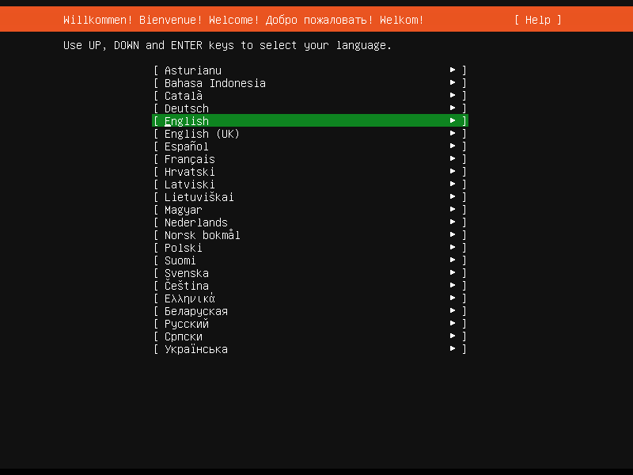

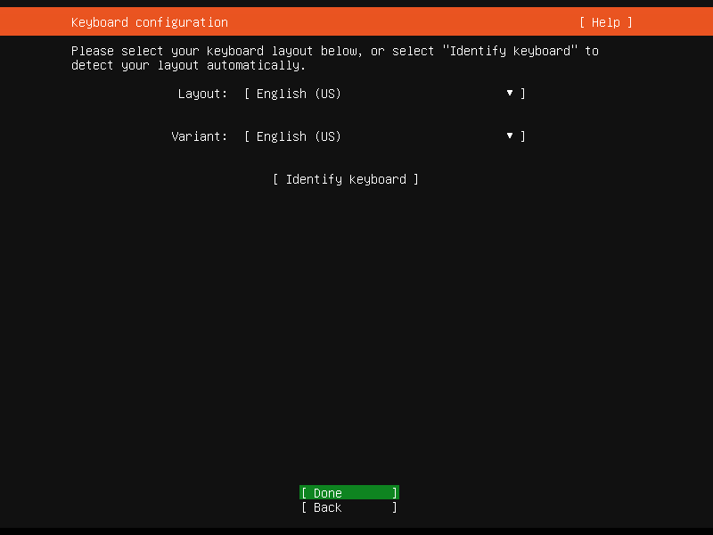


## 最小化安装

### Network connections [默认]

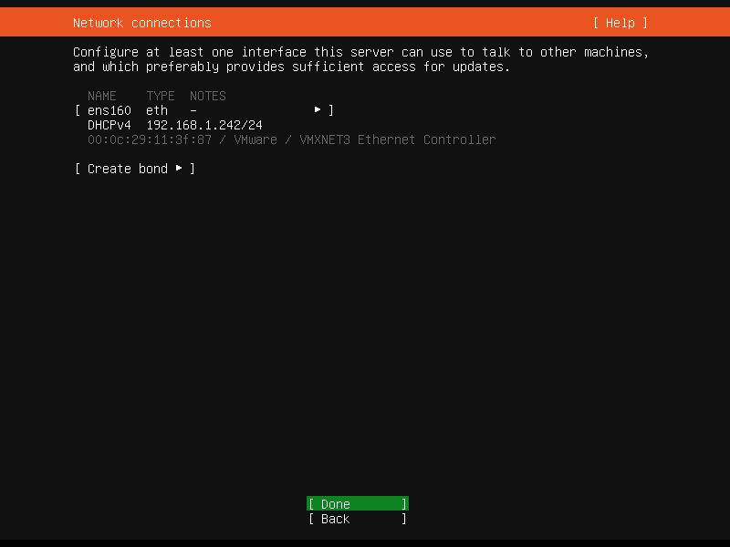

### Cofigure Proxy [默认]

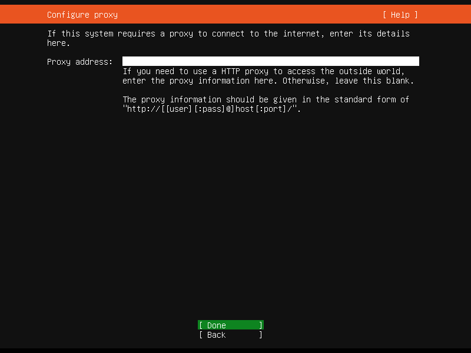

### Configure Ubuntu archive mirror [默认]

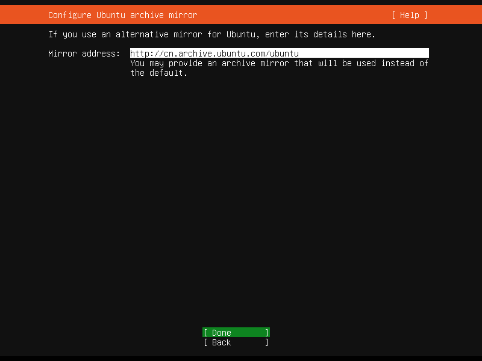

### Guided storage configuration [默认]

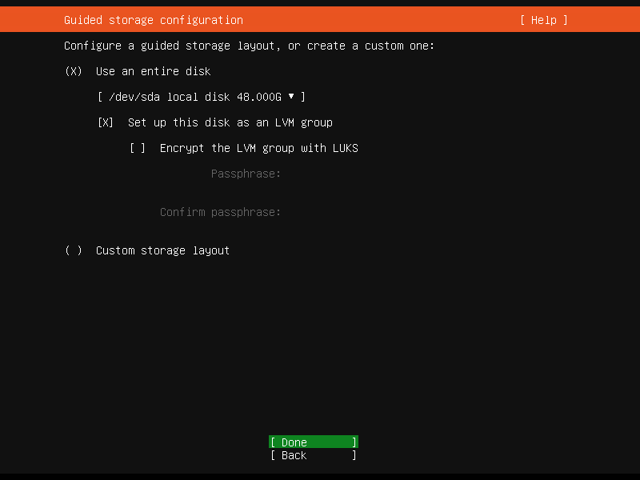

### Storage configuration [默认]

**注意**： /dev/sdb 为 `unused`状态

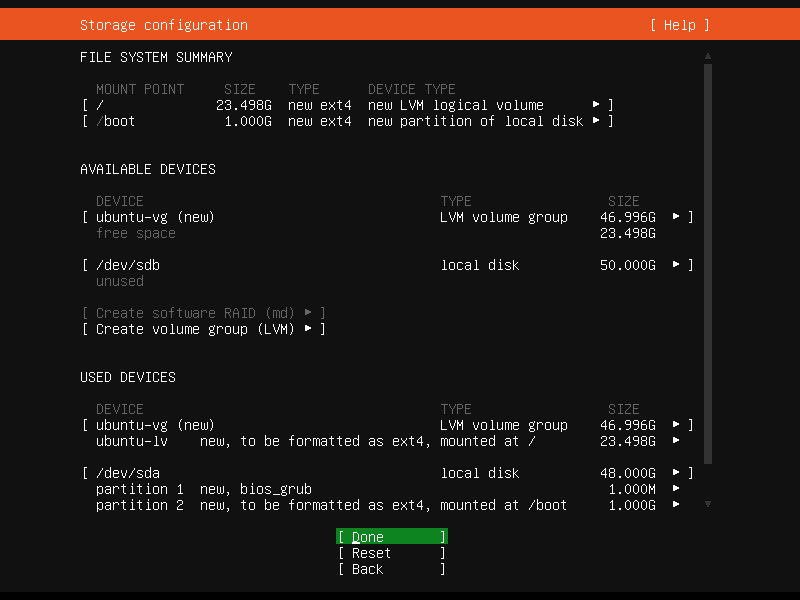

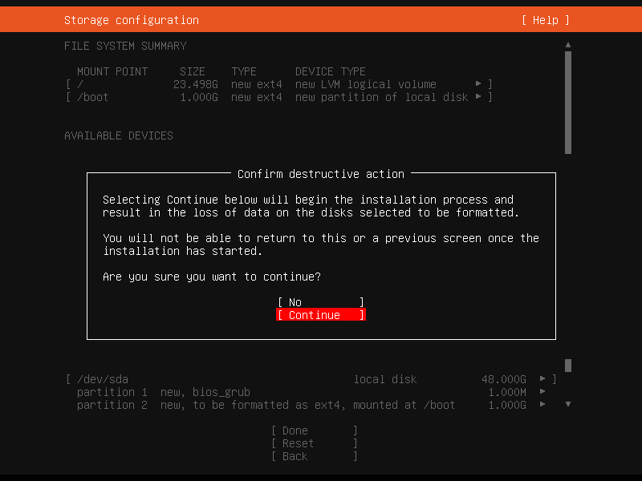

### Profile setup

根据提示填写相应配置的内容。

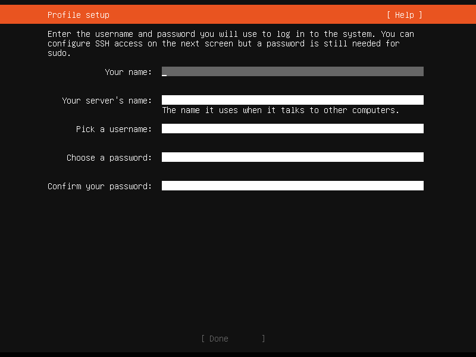

### SSH Setup

**启用** OpenSSH server

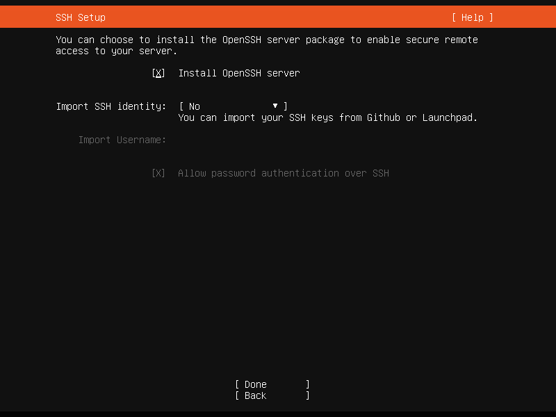

### Featured Server Snaps [默认]

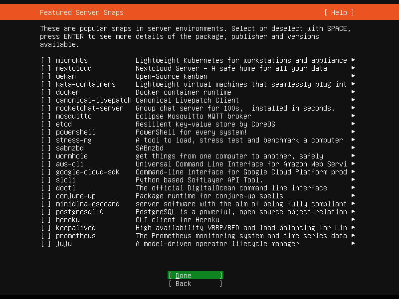

### Installing system

开始安装系统，并等待安装完成。

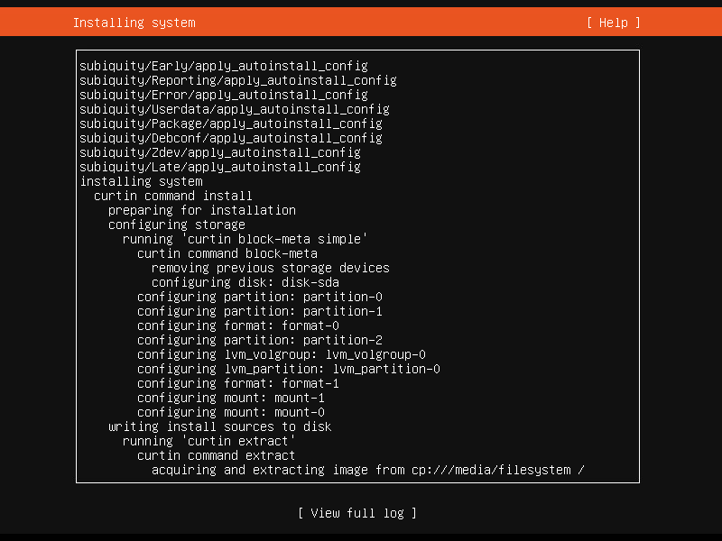

### Install complete

​	安装完成，重启系统。

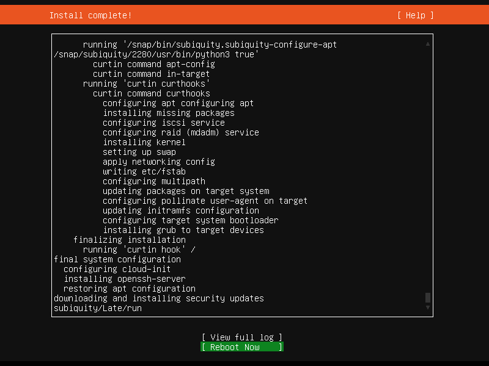

#  下载资源安装包

只在主节点也就是`节点 pbx01` 执行如下命令：

```shell
[root@pbx01 ~]# wget http://www.portsip.cn/downloads/portsip-pbx-ha-guide-12-online.tar.gz && tar xf portsip-pbx-ha-guide-12-online.tar.gz && cd portsip-pbx-ha-guide
```


# 安装ansible
只在主节点也就是`节点 pbx01` 执行如下命令：
```shell
[root@pbx01:~]# apt update -y
[root@pbx01:~]# apt install -y ansible
[root@pbx01:~]# sed -i 's#\#log_path = /var/log/ansible.log#log_path = /var/log/ansible.log#g' /etc/ansible/ansible.cfg
```

# 设置ansible 资源组

只在主节点也就是`节点 pbx01`执行如下命令：
```shell
[root@pbx01 ~]# cat <<EOF >>/etc/ansible/hosts
[master]
pbx01
[node]
pbx02
pbx03
EOF
```
# 添加解析
注意：需要把下面命令里的 IP 和主机名替换成你实际使用的 IP 和 主机名。

在`所有节点`下执行如下命令：

```shell
[root@pbx01 ~]# cat <<EOF >>/etc/hosts
192.168.78.101 pbx01
192.168.78.102 pbx02
192.168.78.103 pbx03
EOF
```
```
[root@pbx02 ~]# cat <<EOF >>/etc/hosts
192.168.78.101 pbx01
192.168.78.102 pbx02
192.168.78.103 pbx03
EOF
```

```
[root@pbx03 ~]# cat <<EOF >>/etc/hosts
192.168.78.101 pbx01
192.168.78.102 pbx02
192.168.78.103 pbx03
EOF
```

# 设置免密码登录

本例中，pbx01、pbx02、pbx03分别是指节点1、节点2和节点3。
**以下命令只需在主节点也就是节点 pbx01 上执行，并按照提示生成证书：**

```shell
[root@pbx01 ~]# ssh-keygen -t rsa 
Generating public/private rsa key pair.
Enter file in which to save the key (/root/.ssh/id_rsa):   输入回车
Enter passphrase (empty for no passphrase):  输入回车
Enter same passphrase again:  输入回车
Your identification has been saved in /root/.ssh/id_rsa.
Your public key has been saved in /root/.ssh/id_rsa.pub.
The key fingerprint is:
SHA256:zEsSndOuTmwMChtQXPDlMoYHELlIKq5HOxwIR1x+zO4 root@kubernetes01
The key's randomart image is:
+---[RSA 2048]----+
|o*++o .          |
|.o+= = . o       |
|=o. B * + .      |
|*..o = + o       |
|+oo   + S .      |
|..o+ o * o       |
|.o.o. E B        |
|. =    +         |
| . .    .        |
+----[SHA256]-----+
[root@pbx01 ~]# 
```
**设置 pbx01 免密码登录（在节点 pbx01上执行）：**

```shell

// 根据提示输入密码，如果出现（yes/no）?,需要输入yes
[root@pbx01 ~]# ssh-copy-id -i ~/.ssh/id_rsa.pub pbx01
```

**设置 pbx02 免密码登录（在节点 pbx01上执行）：**

```shell

// 根据提示输入密码，如果出现（yes/no）?,需要输入yes
[root@pbx01 ~]# ssh-copy-id -i ~/.ssh/id_rsa.pub pbx02
```

**设置 pbx03 免密码登录（在节点 pbx01上执行）：**

```shell

// 根据提示输入密码，如果出现（yes/no）?,需要输入yes
[root@pbx01 ~]# ssh-copy-id -i ~/.ssh/id_rsa.pub pbx03
```

# 设置变量
| 参数名            | 类型   | 说明                                                         |
| ----------------- | ------ | ------------------------------------------------------------ |
| pbx01_hostname    | 字符串 | 节点1主机名，当前示例为：pbx01                               |
| pbx02_hostname    | 字符串 | 节点2主机名，当前示例为：pbx02                               |
| pbx03_hostname    | 字符串 | 节点3主机名，当前示例为：pbx03                               |
| pbx01_private_ip  | 字符串 | 节点1内网**静态**IP地址，当前示例为：192.168.78.101          |
| pbx02_private_ip  | 字符串 | 节点2内网**静态**IP地址，当前示例为：192.168.78.102          |
| pbx03_private_ip  | 字符串 | 节点3内网**静态**IP地址，当前示例为：192.168.78.103          |
| vip               | 字符串 | 虚拟IP地址，当前示例为：192.168.78.90                        |
| pcs_hacluster_pwd | 字符串 | 集群依赖的系统用户hacluster密码，当前示例为：123456          |
| db_pwd            | 字符串 | 集群中数据库密码，当前示例为：123456                          |
| pbx_image         | 字符串 | PortSIP PBX docker镜像，当前示例为：portsip/pbx:12.6         |
| pbx_datapath_disk | 字符串 | 数据磁盘符号路径，当前示例为：/dev/sdb                       |
| pbx_datapath_size | 字符串 | 数据磁盘符大小，当前示例为：49G（直接使用50G可能报错空间不足）<br>比如数据盘大小是 500G 空间，建议使用 495G 或者 490G |

**注意把相关信息改为自己真实的信息**

如下命令只在主节点也就是`节点 pbx01` 上执行。

```shell
[root@pbx01 ~]# cd /root/portsip-pbx-ha-guide
[root@pbx01 ~]# cat <<EOF >/root/portsip-pbx-ha-guide/vars.yml
pbx01_hostname: pbx01
pbx02_hostname: pbx02
pbx03_hostname: pbx03
pbx01_private_ip: 192.168.78.101
pbx02_private_ip: 192.168.78.102
pbx03_private_ip: 192.168.78.103
vip: 192.168.78.90
pcs_hacluster_pwd: 123456
db_pwd: 123456
pbx_image: portsip/pbx:12.6
pbx_datapath_disk: /dev/sdb
pbx_datapath_size: 49G
EOF
```


# 安装资源
只在主节点也就是`节点 pbx01` 执行如下命令：
```shell
[root@pbx01 ~]# ansible-playbook install.yml
```


# 重启
只在主节点也就是`节点 pbx01` 执行如下命令：
```
[root@pbx01 ~]# ssh pbx02 "reboot"
[root@pbx01 ~]# ssh pbx03 "reboot"
[root@pbx01 ~]# reboot
```

# 启动pcs
重启之后，只在主节点也就是`节点 pbx01` 执行如下命令：
```
[root@pbx01 ~]# pcs cluster enable --all
[root@pbx01 ~]# pcs cluster start --all
```


# 初始化配置资源
只在主节点也就是`节点 pbx01` 执行如下命令（执行过程可能较长，耐心等待即可，中途不要中断、重启或者关机）：
```
[root@pbx01 ~]# cd /root/portsip-pbx-ha-guide/ && ansible-playbook config.yml
```

资源配置完成后，您可以使用浏览器打开 http://192.168.78.90:8888 或者  https://192.168.78.90:8887 来配置您的 PBX。

后续对 PBX 的管理配置和访问，都是通过 Virtual IP 192.168.78.90 来进行。

设置向导的第一步填写 Virtual IP，您需要替换为您的实际 Virtual IP。


进入 PBX 的 web 管理界面后，在菜单 **Advanced > Settings > Advanced** 页面下勾选 **Enable call recovery** 并点击 "**Apply**" 按钮。


# 几个常用的命令
```
基于/root/portsip-pbx-ha-guide目录
```

## 查看 PBX 状态

```
/bin/bash ./bin/pbx-status

如下输出，信息表示所有组件运行正常，pbx03为master pbx01、pbx02为slave节点
[root@pbx01 portsip-pbx-ha-guide]# /bin/bash ./bin/pbx-status
 Master/Slave Set: drbd_devpath-clone [drbd_devpath]
     Masters: [ pbx03 ]
     Slaves: [ pbx01 pbx02 ]
 vip  (ocf::heartbeat:IPaddr2):  Started pbx03
 src_pkt_ip  (ocf::heartbeat:IPsrcaddr):  Started pbx03
 datapath_fs  (ocf::heartbeat:Filesystem):  Started pbx03
 pbx  (ocf::portsip:pbx):  Started pbx03
[root@pbx01 portsip-pbx-ha-guide]# 

```


## 重启 PBX资源

如下命令执行后，将会重启整个集群pbx相关资源。

```
/bin/bash ./bin/pbx-restart


如下是执行成功的输出信息
[root@pbx01 portsip-pbx-ha-guide]# /bin/bash ./bin/pbx-restart
drbd_devpath_master successfully restarted
vip successfully restarted
src_pkt_ip successfully restarted
datapath_fs successfully restarted
pbx successfully restarted
[root@pbx01 portsip-pbx-ha-guide]# 
```