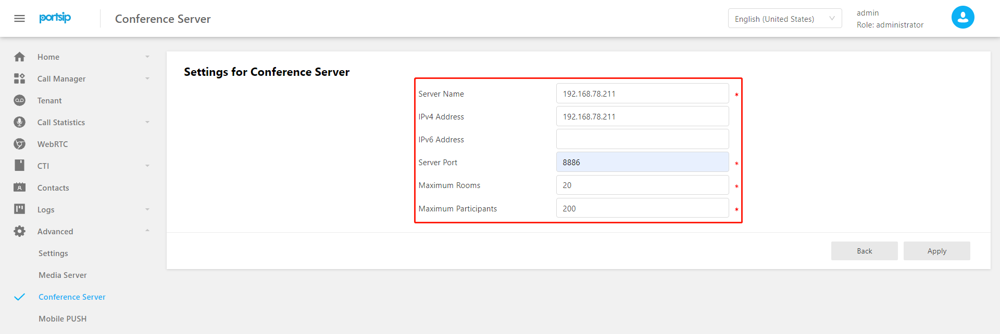

# 目录
[TOC]

# 简介

为了提供高服务器的性能和高可用性，PortSIP PBX 支持将会议服务器从 PBX 服务器剥离，单独部署在其他服务器上进行扩展。

本文提供扩展安装会议服务器的步骤指南。

假定我们扩展安装三台会议服务器， 该三台会议服务器的主机名和 IP 设置为如下:


```
192.168.78.211 conf01
192.168.78.212 conf02
192.168.78.213 conf03
```


硬盘大小推荐最小为100G，无需额外的数据盘。

**操作系统的版本和安装必须和 PBX 服务器操作系统一致（无需额外分配数据盘）。**


首先请确认已经按照手册将 PBX HA 集群安装完毕。


# 设置免密码登录

**设置媒体服务器免密码登录（只需在节点 pbx01上执行）：**

```shell

// 根据提示输入密码，如果出现（yes/no）?,需要输入yes
[root@pbx01 ~]# ssh-copy-id -i ~/.ssh/id_rsa.pub 192.168.78.211
[root@pbx01 ~]# ssh-copy-id -i ~/.ssh/id_rsa.pub 192.168.78.212
[root@pbx01 ~]# ssh-copy-id -i ~/.ssh/id_rsa.pub 192.168.78.213
```


# 安装

## 配置扩展会议服务器

1. 通过浏览器打开 PBX 配置界面： http://192.168.78.90:8888，这里的 IP 是 PBX HA 集群的虚拟IP。输入用户名和密码: admin/admin。

2. 打开菜单 `Advanced  -> Conference Server`，点击 `Add` 按钮，按照如下截图输入扩展会议服务器的信息。

   

   <br/>**注意**：属性`Server Name`配置内容**必须**为相应服务器的IP地址。

3. 依次将 conf02和 conf03 服务器配置完成。

   配置成功后，在会议服务器列表界面，这三台服务器显示为 `offline` 状态。

## 安装服务

只在主节点也就是`节点 pbx01` 依次执行如下命令（执行过程可能较长，耐心等待即可，中途不要中断、重启或者关机）：

```shell
[root@pbx01 ~]# cd /root/portsip-pbx-ha-guide/ && /bin/sh install_ext_conf.sh 192.168.78.211
[root@pbx01 ~]# cd /root/portsip-pbx-ha-guide/ && /bin/sh install_ext_conf.sh 192.168.78.212
[root@pbx01 ~]# cd /root/portsip-pbx-ha-guide/ && /bin/sh install_ext_conf.sh 192.168.78.213
```

安装成功后，刷新会议服务器列表界面，这三台服务器应该显示为 `online` 状态。
