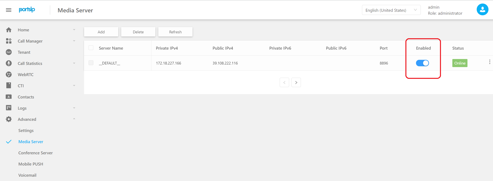
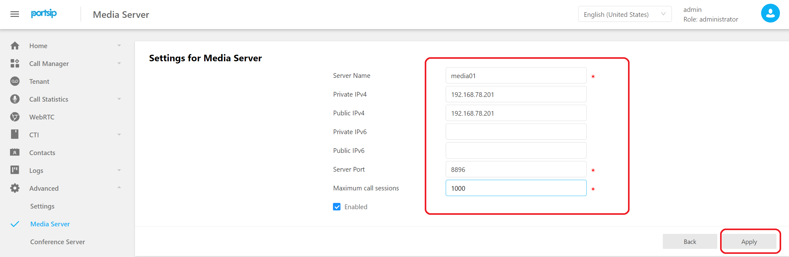

# Index
[TOC]

## Overview

The PortSIP PBX supports clustering the media server to improve performance and support high numbers of simultaneous calls.

Assume we need to deploy three media servers as a cluster for a PBX, and the information for these media servers is listed below.

```shell
192.168.78.201 media01
192.168.78.202 media02
192.168.78.203 media03
```

**Note, the server must use static IP, the DHCP is not supported!!**

Suggest the disk size is 128G, no need extra data disk.

**The media server OS must is same with the PBX server OS - just need to extra data disk partition.**

First, confirm that you have completed the PBX HA configuration.

## Set password free login

Set up a password-less login for the media server by perform the following instructions on the **pbx01** only.

Enter the password according to the prompt. If `(yes / no)?` occurs, you need to enter yes

```shell
[root@pbx01 ~]# ssh-copy-id -i ~/.ssh/id_rsa.pub 192.168.78.201
[root@pbx01 ~]# ssh-copy-id -i ~/.ssh/id_rsa.pub 192.168.78.202
[root@pbx01 ~]# ssh-copy-id -i ~/.ssh/id_rsa.pub 192.168.78.203
```

## Setup

### Configure the media server

1. Open the PBX Web Portal: http://192.168.78.90:8888, the IP `192.168.78.90` is your PBX virtual IP.

2. Click the menu `Advanced  -> Media Server`，Click the SWITCH button to disable the media server.

   

3. Click the `Add` button, enter the media server private IP and public IP as the below screenshot. If the media server is no public IP, just enter the private as the public IP; if the media server is no private IP, just enter the public IP as the private IP.

   

4. Add the  `media02` and `media03` as the above steps。

After successfully completing the setting, the media server will display the status `offline`.

## Install service

Perform the following commands one by one on the PBX node `pbx01` only; it may take some time; simply wait till it is finished; do not interrupt, reboot, or power off.

```shell
[root@pbx01 ~]# cd /root/portsip-pbx-ha-guide/ && /bin/sh install_ext_media.sh 192.168.78.201
[root@pbx01 ~]# cd /root/portsip-pbx-ha-guide/ && /bin/sh install_ext_media.sh 192.168.78.202
[root@pbx01 ~]# cd /root/portsip-pbx-ha-guide/ && /bin/sh install_ext_media.sh 192.168.78.203
```

The media server status in the PBX Web Portal will be `online` after completed.

